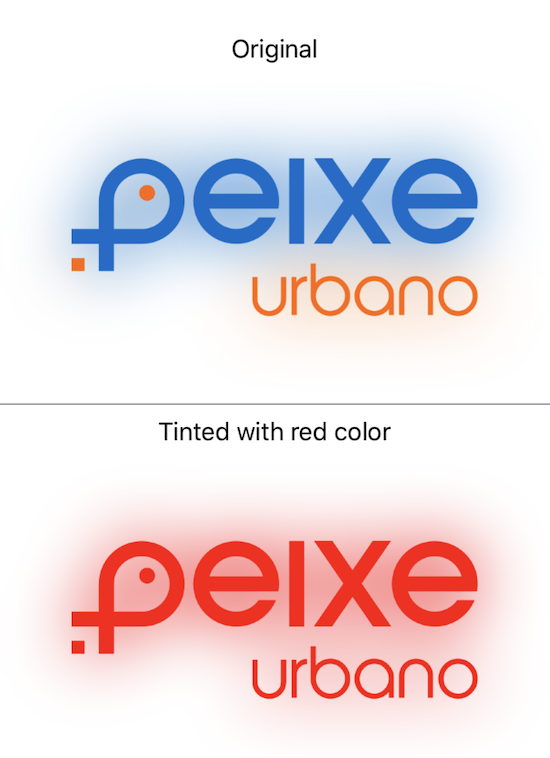
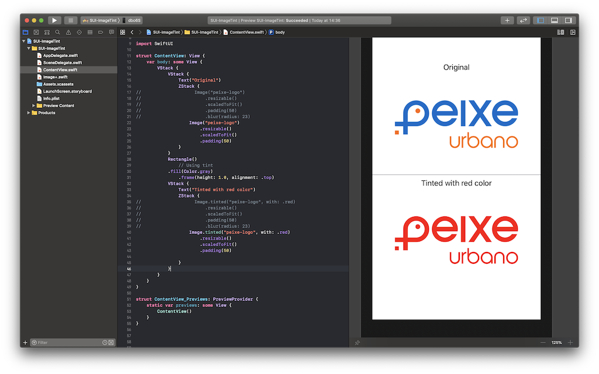

# Image Tint Extension for use in SwiftUI

For now I don't know a better way to tint a view of type Image as we can do with UIImage. So, I did this extension which makes my life better.

Once you copy `Image+.swift` file to your SwiftUI project, you will be able to colorize your Image with just one line of code:

```swift
Image.tinted("peixe-logo", with: .red)
```

result: 





> DISCLAIMER: I don't feel my self confortable about static function as I think this feature fits better on a convenience init passing just the name (string) and a Color object, but for now, I couldn't figure out a better way to do that.

> DISCLAIMER 2: I've tried some combination of native SwiftUI Modifiers on Image, like brightness, saturation and color multiply, but wasn't able to get a good tinted image at the end.
 

--- 

MIT License

Copyright (c) [year] [fullname]

Permission is hereby granted, free of charge, to any person obtaining a copy
of this software and associated documentation files (the "Software"), to deal
in the Software without restriction, including without limitation the rights
to use, copy, modify, merge, publish, distribute, sublicense, and/or sell
copies of the Software, and to permit persons to whom the Software is
furnished to do so, subject to the following conditions:

The above copyright notice and this permission notice shall be included in all
copies or substantial portions of the Software.

THE SOFTWARE IS PROVIDED "AS IS", WITHOUT WARRANTY OF ANY KIND, EXPRESS OR
IMPLIED, INCLUDING BUT NOT LIMITED TO THE WARRANTIES OF MERCHANTABILITY,
FITNESS FOR A PARTICULAR PURPOSE AND NONINFRINGEMENT. IN NO EVENT SHALL THE
AUTHORS OR COPYRIGHT HOLDERS BE LIABLE FOR ANY CLAIM, DAMAGES OR OTHER
LIABILITY, WHETHER IN AN ACTION OF CONTRACT, TORT OR OTHERWISE, ARISING FROM,
OUT OF OR IN CONNECTION WITH THE SOFTWARE OR THE USE OR OTHER DEALINGS IN THE
SOFTWARE.
